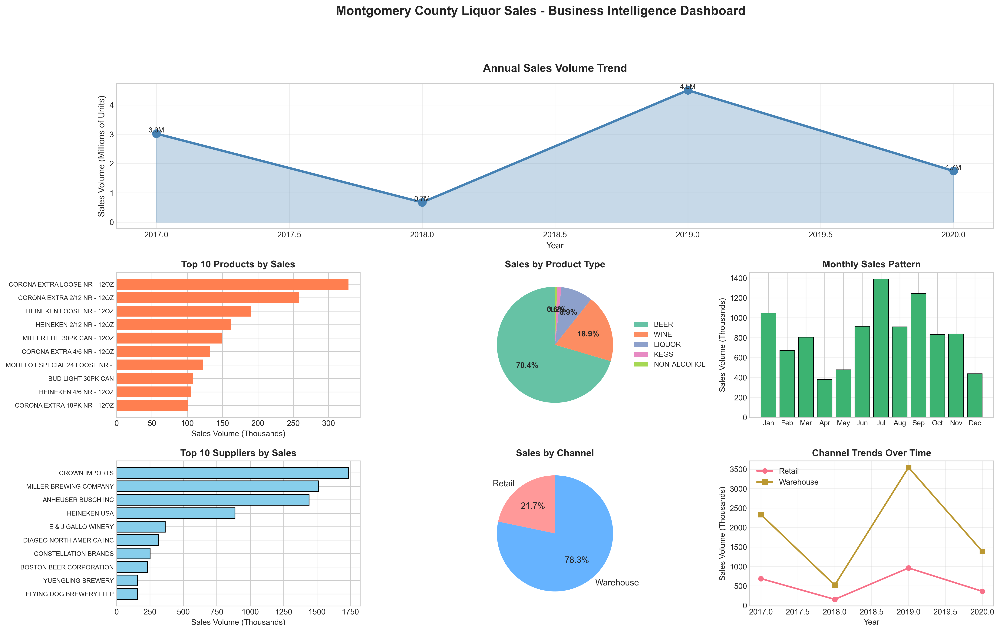

# Montgomery County Liquor Sales Analysis

## Business Intelligence Project

A comprehensive analysis of liquor sales data from Montgomery County (2017-2020) to identify sales trends, optimize inventory management and provide strategic business recommendations.



## Project Objective

**Business Context:** As a Data Analyst for Montgomery County's Department of Liquor Control, the goal was to analyze 4 years of sales data to:

- Identify top-performing products and suppliers
- Understand seasonal sales patterns
- Optimize inventory and channel distribution
- Assess supplier concentration risk
- Provide actionable recommendations for revenue growth

## Key Findings

### Sales Performance

- **Total Sales Volume:** 9.9 million units across 4 years
- **Channel Split:** Warehouse (78.3%) vs Retail (21.7%)
- **Product Mix:** Beer dominates with 70.4% of sales

### Top Performers

1. **#1 Product:** Corona Extra Loose NR - 328K units (3.3% of total sales)
2. **#1 Supplier:** Crown Imports - 1.7M units (17.5% of total sales)
3. **Peak Month:** July - 1.4M units (summer seasonality)

### Business Insights

- **High Supplier Concentration:** Top 5 suppliers account for 59.7% of sales (risk factor)
- **Seasonal Pattern:** Clear summer peak (July) and spring trough (April)
- **Sales Volatility:** Significant year-over-year fluctuations (-77% in 2018, +569% in 2019)

## Technologies Used

- **Python 3.x** - Core analysis language
- **Pandas** - Data manipulation and aggregation
- **Matplotlib & Seaborn** - Data visualization
- **NumPy** - Numerical computations
- **Jupyter Notebook** - Interactive analysis

## Project Structure

```
montgomery-liquor-sales-analysis/
├── data/
│   ├── Warehouse_and_Retail_Sales.csv      # Raw sales data
│   └── sales_summary.csv                   # Processed monthly aggregates
├── results/
│   ├── liquor_sales_dashboard.png          # Executive dashboard
│   └── monthly_sales_trend.png             # Time series visualization
├── liquor_sales.py                         # Main analysis script
├── sales_analysis.ipynb                    # Jupyter notebook
└── README.md                               # Project documentation
```

## How to Run

### Prerequisites

```bash
pip install pandas numpy matplotlib seaborn jupyter
```

### Run the Analysis Script

```bash
python liquor_sales.py
```

### View Interactive Notebook

```bash
jupyter notebook sales_analysis.ipynb
```

## Analysis Components

### 1. Data Quality Assessment

- Checked for missing values (< 0.1% missing)
- Validated data types and ranges
- Identified and handled negative values (returns/adjustments)

### 2. Feature Engineering

- Created `TOTAL SALES` metric (Retail + Warehouse)
- Constructed datetime features for time series analysis
- Calculated year-over-year growth rates

### 3. Business Metrics Analysis

- **Revenue Trends:** Annual and monthly sales patterns
- **Product Performance:** Top products, suppliers, and categories
- **Channel Analysis:** Retail vs Warehouse distribution
- **Seasonality:** Monthly patterns and peak periods
- **Risk Assessment:** Supplier concentration analysis

### 4. Visualizations

Created 7-panel executive dashboard showing:

- Annual sales volume trend
- Top 10 products by sales
- Product type distribution (pie chart)
- Monthly seasonality pattern
- Top 10 suppliers
- Channel split (Retail vs Warehouse)
- Channel trends over time

## Business Recommendations

### 1. Inventory Optimization

- **Focus on top 10 products** which represent 20%+ of volume
- Maintain higher safety stock for Corona Extra, Heineken, and Miller Lite
- Consider discontinuing low-volume SKUs to reduce complexity

### 2. Supplier Risk Management

- **High concentration risk:** Top 5 suppliers = 60% of sales
- Develop relationships with alternative suppliers as contingency
- Negotiate better terms leveraging volume with top suppliers

### 3. Seasonal Planning

- **July preparation:** Increase inventory 3 months in advance
- **April promotions:** Launch campaigns during slowest month
- Adjust staffing levels based on seasonal patterns

### 4. Channel Strategy

- **Optimize warehouse operations** (78% of volume)
- Evaluate retail channel profitability vs warehouse
- Consider customer preference analysis for channel mix

### 5. Product Portfolio Management

- **Beer focus:** Maintain strong beer portfolio (70% of sales)
- **Wine growth opportunity:** Currently 19% - potential to expand
- Review liquor category strategy (currently 9%)

### 6. Address Volatility

- Investigate causes of extreme year-over-year swings
- Implement more robust forecasting models
- Develop contingency plans for demand fluctuations

## Data Source

**Dataset:** Montgomery County Warehouse and Retail Sales  
**Source:** [Data.gov](https://catalog.data.gov/dataset/warehouse-and-retail-sales)  
**Publisher:** Montgomery County of Maryland  
**Period:** 2017-2020  
**Records:** 307,645 transactions  
**Update Frequency:** Monthly

## Skills Demonstrated

This project showcases:

- **Data Cleaning:** Handling missing values, data type conversions
- **Business Analysis:** KPI development, trend analysis, strategic thinking
- **Python Proficiency:** Pandas, NumPy, data manipulation
- **Data Visualization:** Matplotlib, Seaborn, executive dashboards
- **Statistical Analysis:** YoY growth, seasonality detection, concentration metrics
- **Communication:** Clear insights, actionable recommendations
- **Domain Knowledge:** Retail/wholesale operations, inventory management

## Author

Created as a portfolio project to demonstrate business intelligence and data analysis capabilities for Data Analyst and Business Intelligence Analyst positions.

## Last Updated

February 2026

---
